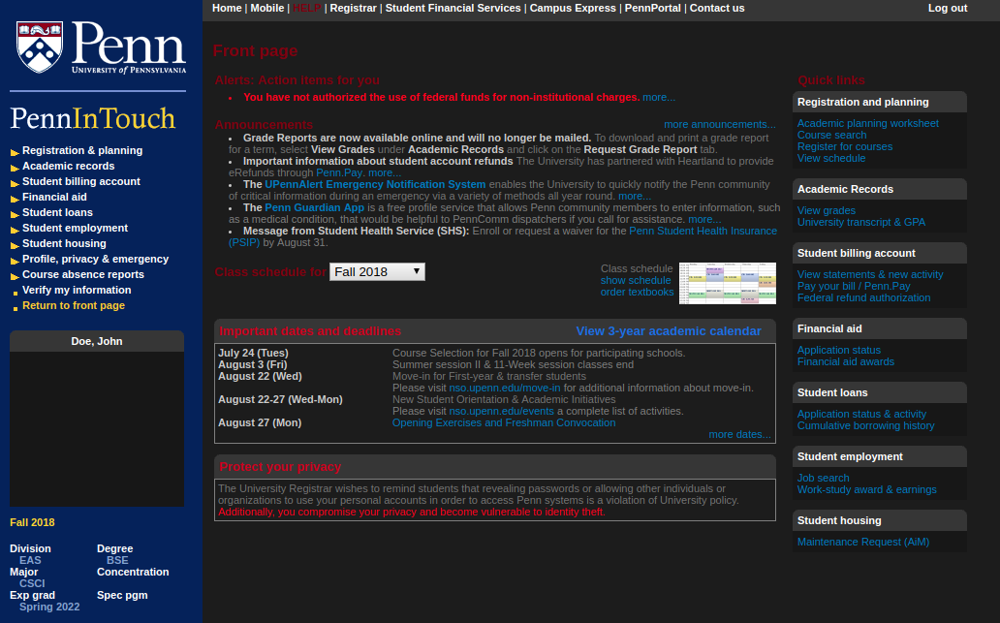

### About
Penn InTouch Dark applies a dark theme to Penn InTouch through a custom .user.css file. The theme gets automatically updated once it is installed.

### Installation

Install [Stylus](https://add0n.com/stylus.html) for [Chrome](https://chrome.google.com/webstore/detail/stylus/clngdbkpkpeebahjckkjfobafhncgmne), [Firefox](https://addons.mozilla.org/en-US/firefox/addon/styl-us/), or [Opera](https://addons.opera.com/en-gb/extensions/details/stylus/).

Then: [Install the usercss](https://raw.githubusercontent.com/ArmaanT/Penn-InTouch-Dark/master/penn-intouch-dark.user.css).

### Preview

### Modifications
You can also modify different colors in the dark theme:

- Navigate to [Penn InTouch](https://pennintouch.apps.upenn.edu/pennInTouch/jsp/fast2.do) in your browser
- Click on the Stylus icon to the right of the address bar
- Click on the gear next to "Penn InTouch Dark"
- Click on a color box to change that color 